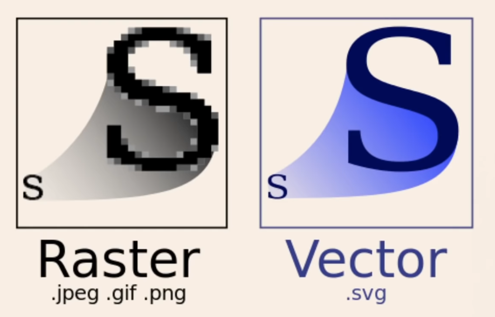

# data-vis

Collection of Visualization utilities for personal reuse written in `React.js` and `d3`.

- Raster graphics vs Vector Graphics

## Resources for inspiration

- [Reuters Graphics](https://graphics.reuters.com/)
- [Upshot - NYTimes](https://www.nytimes.com/international/section/upshot)
- [Pudding: is a digital publication that explains ideas debated in culture with visual essays.](https://pudding.cool/)
- [Five Thirty Eight - Nate Silver](https://fivethirtyeight.com/)
- [Kantar](https://www.informationisbeautifulawards.com/)
